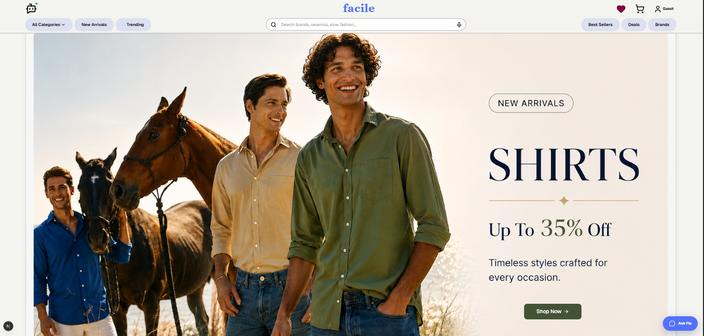
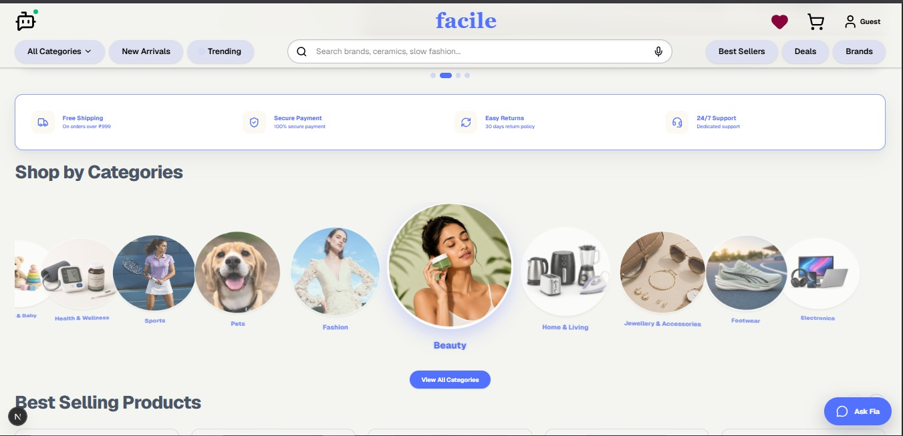
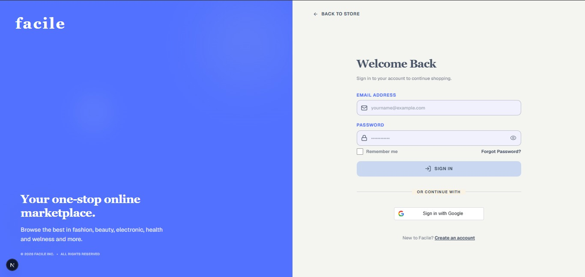
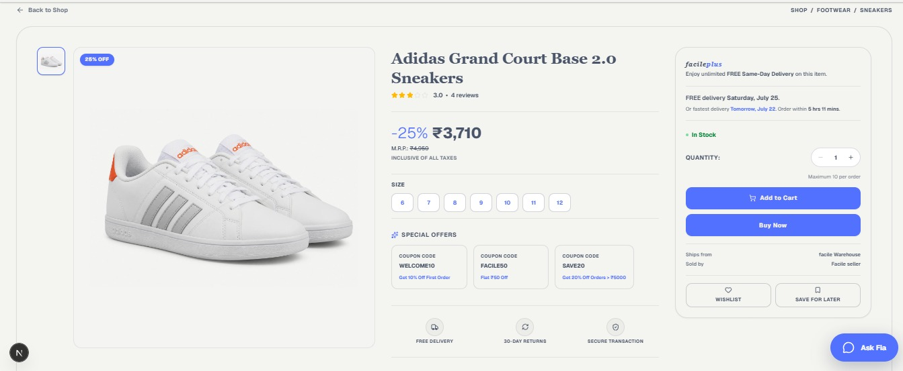
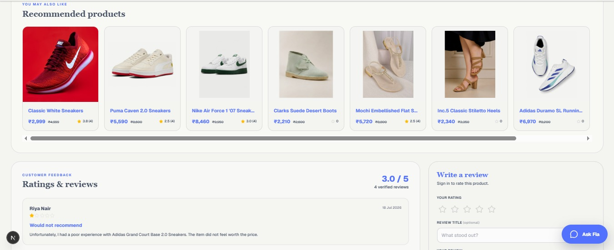
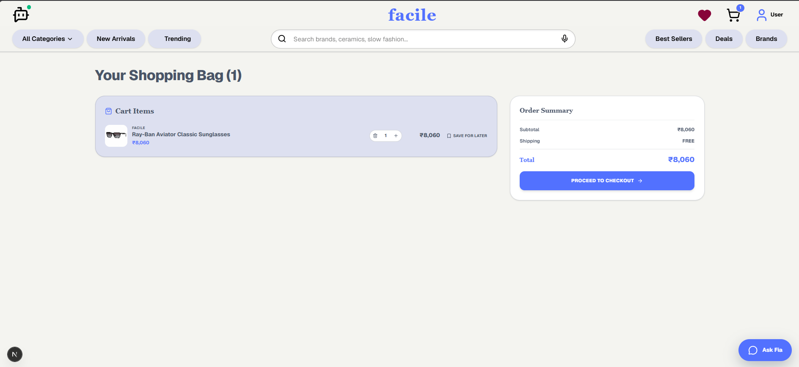
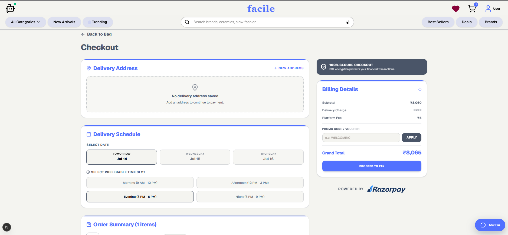
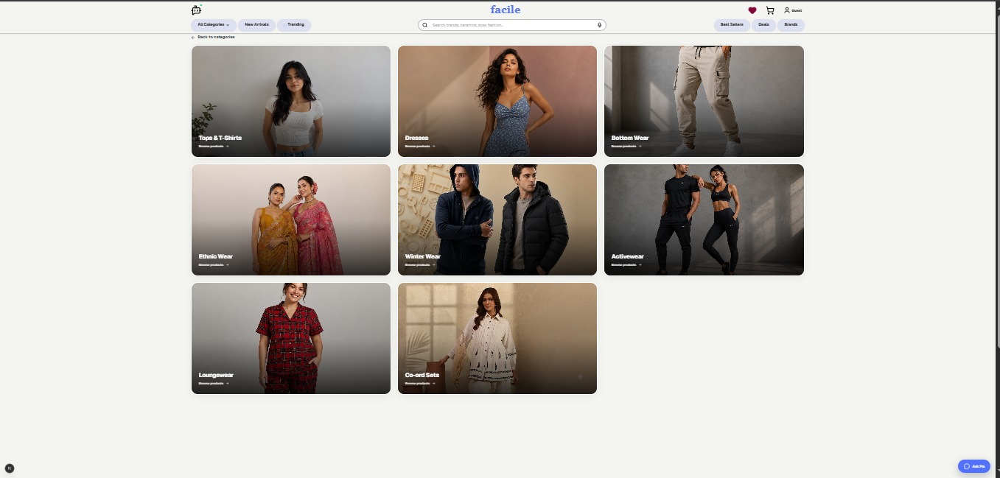

FACILE is an AI-powered, voice-first shopping platform built on a microservices architecture. Instead of typing, scrolling, and filtering, users can simply speak — search for products, add items to their cart, and check out, all through natural voice commands. Under the hood, a local Whisper-based speech pipeline turns spoken queries into product searches, while a set of independent backend services handle authentication, inventory, cart & orders, and payments — all fronted by a fast, modern Next.js interface.

🔗 **Live Demo:** [Coming Soon]()

**🔗 Live Demo:** _Coming soon_

---

## 📖 Table of Contents

- [Features](#-features)
- [How It Works](#-how-it-works)
- [Screenshots](#-screenshots)
- [Tech Stack](#-tech-stack)
- [Project Structure](#-project-structure)
- [Getting Started](#-getting-started)
- [Roadmap](#-roadmap)
- [Contributing](#-contributing)
- [Contact](#-contact)

---

## ✨ Features

- 🎙️ **Voice-Powered Shopping** — search for and add products to your cart using natural speech, powered by a local Whisper speech-to-text pipeline
- 🔐 **Secure Authentication** — dedicated auth service for user sign-up, login, and session handling
- 🛍️ **Product Catalog & Inventory** — browse and search a live product catalog backed by a dedicated inventory service
- 🛒 **Cart & Orders** — add-to-cart, order creation, and order history via a Redis-backed cart and MongoDB-backed order service
- 💳 **Payments & Notifications** — dedicated service for handling payment processing and user notifications
- ⚡ **Modern, Responsive UI** — built with Next.js and Tailwind CSS, with smooth animations via Framer Motion
- 🧩 **Microservices Architecture** — independently deployable services for auth, inventory, orders/cart, and payments, orchestrated together for local development

---

## 🎙 How It Works

1. **Speak your request** — e.g. *"Show me fitted shirts"* or *"Add this to my cart"*
2. **Speech-to-text** — a local Whisper model transcribes the voice input
3. **Understanding intent** — the transcribed query is mapped to a product search, cart action, or navigation command
4. **Instant results** — the inventory service returns matching products, rendered in the Next.js UI in real time

---

## 📸 Product Preview

<table align="center">
  <tr>
    <td align="center"><b>Homepage</b></td>
    <td align="center"><b>Home</b></td>
  </tr>
  <tr>
    <td></td>
    <td></td>
  </tr>
  <tr>
    <td align="center"><b>Product Discovery</b></td>
    <td align="center"><b>Login</b></td>
  </tr>
  <tr>
    <td></td>
    <td></td>
  </tr>
  <tr>
    <td align="center"><b>Products</b></td>
    <td align="center"><b>Ratings</b></td>
  </tr>
  <tr>
    <td></td>
    <td></td>
  </tr>
  <tr>
    <td align="center"><b>Cart</b></td>
    <td align="center"><b>Checkout</b></td>
  </tr>
  <tr>
    <td></td>
    <td></td>
  </tr>
  <tr>
    <td align="center" colspan="2"><b>Cateogaries</b></td>
  </tr>
  <tr>
    <td align="center" colspan="2"></td>
  </tr>
</table>

---

## 🛠 Tech Stack

**🎨 Frontend**
- [Next.js](https://nextjs.org/) — React framework for the storefront UI
- [React](https://react.dev/) — component-based UI
- [TypeScript](https://www.typescriptlang.org/) — type-safe application code
- [Tailwind CSS](https://tailwindcss.com/) — utility-first styling
- [Framer Motion](https://www.framer.com/motion/) — animations and transitions
- [Swiper](https://swiperjs.com/) — carousels for product browsing
- [Axios](https://axios-http.com/) — HTTP client for service communication
- [Jimp](https://github.com/jimp-dev/jimp) — image processing for product assets

**🧠 Voice / AI**
- Local **Whisper**-based speech-to-text pipeline for voice search and commands

**⚙️ Backend — Microservices**
- **auth-user-service** — Java / Spring Boot — authentication & user management
- **order-cart-service** — Java / Spring Boot — cart and order management (MongoDB, Redis)
- **payment-notification-service** — Java / Spring Boot — payments and notifications
- **product-inventory-service** — Node.js — product catalog & inventory

**🗄️ Data Layer**
- [MongoDB](https://www.mongodb.com/) — cart, order, and checkout-saga data
- [PostgreSQL](https://www.postgresql.org/) — relational data
- [Supabase](https://supabase.com/) — managed Postgres & backend services

**☁️ Tooling & Deployment**
- [Docker Compose](https://docs.docker.com/compose/) — local orchestration of Mongo, Redis, and Postgres
- `concurrently` — run frontend and all backend services together in dev
- Git & GitHub — version control and source hosting

---

## 📁 Project Structure

\`\`\`text
FACILE/
├── FRONTEND/                        # Next.js storefront (voice-powered UI)
├── auth-user-service/               # Spring Boot — authentication & users
├── order-cart-service/              # Spring Boot — cart & orders (MongoDB, Redis)
├── payment-notification-service/    # Spring Boot — payments & notifications
├── product-inventory-service/       # Node.js — product catalog & inventory
├── scripts/                         # Dev automation (frontend/inventory launchers, Whisper setup)
├── .vscode/
├── docker-compose.yml               # MongoDB, Redis, PostgreSQL for local dev
├── supabase_migration.sql
├── product_images_migration.sql
├── review_rating_migration.sql
├── package.json                     # Root scripts to run the whole stack together
└── README.md
\`\`\`

---

## 🚀 Getting Started

### Prerequisites

- Node.js (v18+ recommended)
- Java (17+) & Maven (via the included \`mvnw\` wrapper)
- Docker (for MongoDB, Redis, and PostgreSQL)
- npm

### Installation

1. **Clone the repository**
   \`\`\`bash
   git clone https://github.com/Aash1B/FACILE.git
   cd FACILE
   \`\`\`

2. **Install root dependencies**
   \`\`\`bash
   npm install
   \`\`\`

3. **Set up environment variables**
   Add the required \`.env\` files for the frontend and each backend service (database URLs, Supabase keys, service ports, etc.).

4. **Set up local voice support**
   \`\`\`bash
   npm run setup:voice
   \`\`\`

5. **Start the databases**
   \`\`\`bash
   npm run dev:databases
   \`\`\`

6. **Run the full stack** (frontend + all backend services)
   \`\`\`bash
   npm run dev
   \`\`\`

   Or run pieces individually:
   \`\`\`bash
   npm run dev:frontend           # Next.js storefront
   npm run dev:backend-auth       # Auth service
   npm run dev:backend-order      # Order & cart service
   npm run dev:backend-payment    # Payment & notification service
   npm run dev:backend-inventory  # Inventory service
   \`\`\`

7. Open the app in your browser at the port shown in your frontend logs.

---

## 🗺 Roadmap

- [ ] Multi-language voice commands
- [ ] Conversational follow-up queries (e.g. "show me a cheaper one")
- [ ] Order tracking via voice
- [ ] Mobile app support

---

## 🤝 Contributing

Contributions are welcome!

1. Fork the repo
2. Create your feature branch (\`git checkout -b feature/amazing-feature\`)
3. Commit your changes (\`git commit -m 'Add amazing feature'\`)
4. Push to the branch (\`git push origin feature/amazing-feature\`)
5. Open a Pull Request

---

## 📬 Contact

This project was developed by:

- [Aashi](https://github.com/Aash1B)
- [Ananya Tamta](https://github.com/Ananya-2026)
- [Kritagya Arora](https://github.com/Kritagyaaa)
- [Shubham Katyan](https://github.com/shubhamkatyan1324)

For any queries, feel free to open an issue in this repository.

---

Made with 🎙️ and a lot of ☕

